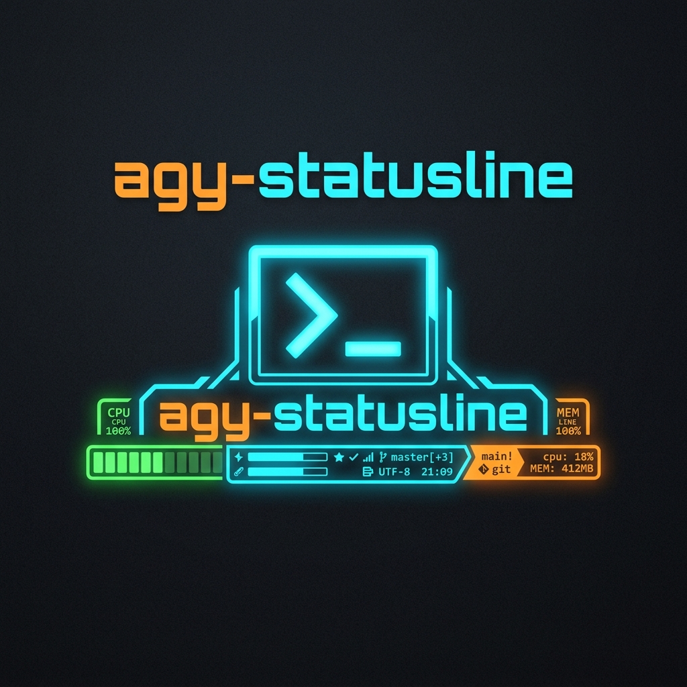

# Antigravity Statusline Customizer

<p align="center">
  
</p>

Custom statusline implementations for the Antigravity CLI, optimized for performance and visual consistency.

## Features

- **High Performance**: Native startup under Bun (`~3ms`) or Node.js (`~15ms`), fitting safely below the CLI's `150ms` execution timeout.
- **Token Scale & Rounding**: Displays cumulative input and output token counts in `k` scale, rounded to the nearest integer.
- **Dynamic Context Warnings**: Colorizes context usage text automatically based on total input token counts:
  - **Cyan**: Normal ($<160\text{k}$ tokens)
  - **Orange**: Warning ($\ge 160\text{k}$ tokens)
  - **Red**: Alert ($\ge 200\text{k}$ tokens)
- **20-Step Progress Bar**: Visualizes context usage percentage in 5% increments (`[■■■■□□□□□□□□□□□□□□□□]`).
- **Compact & Split Layout**: Calibrates spaces dynamically according to your `terminal_width` to push the folder and model information cleanly to the right side.

## Layout Structure

```
? for shortcuts • {progress_bar} {used_pct}% of {limit} • in {input}k | out {output}k           {cwd} • {model_name}
```

---

## How It Works

1. **Input**: The Antigravity CLI pipes a JSON metadata payload containing session details (active model, workspace, context token consumption, terminal size) into the script via standard input (`stdin`).
2. **Parsing**: The script parses the incoming JSON stream. If `stdin` is empty or times out (safety threshold: `150ms`), it falls back to defaults or reads from the environment variable (`process.env.ANTIGRAVITY_SOURCE_METADATA`).
3. **Calculations**:
   - Calculates cumulative token usage (`total_input_tokens + total_output_tokens`) and rounds the values to integer `k` scales.
   - Selects the statusline alert color (Cyan, Orange, or Red) based on total token limits.
   - Strips ANSI escape codes from formatting templates to measure the true printable character width.
   - Subtracts the printed width from the target `terminal_width` to determine the required padding spaces.
4. **Output**: Writes the aligned statusline directly to standard output (`stdout`) with no trailing newline, enabling the CLI shell wrapper to render it cleanly at the bottom of the prompt.

---

## Installation & Setup

### Installation via NPM

You can install this statusline directly from the npm registry and configure it automatically with a single command:

1. **Install Globally**:
   ```bash
   npm install -g agy-statusline
   ```
   *(or `bun install -g agy-statusline` if using Bun)*

2. **Run Automatic Configuration**:
   ```bash
   agy-statusline-setup
   ```
   *(This automatically locates your `settings.json` configuration file and updates your `statusLine` configuration block).*

3. **Verify Installation** (Optional):
   Run the diagnostics doctor to verify everything is working perfectly:
   ```bash
   agy-statusline-setup doctor
   ```

### Local Setup & Automatic Installation

If you cloned this repository locally, you can set it up using the included `setup.js` script:

Run the setup script using Bun (or Node.js):

```bash
bun setup.js
```

This will automatically:
1. Run `bun link` to register the `agy-statusline` command globally.
2. Locate your Antigravity CLI `settings.json` configuration file.
3. Add or update the `statusLine` configuration block automatically (handling the UTF-8 BOM check correctly):
   ```json
   "statusLine": {
     "type": "command",
     "command": "agy-statusline",
     "enabled": true
   }
   ```

### Manual Local Installation (Alternative)

If you prefer manual setup from the local directory:
1. **Link Globally**: Run `bun link` in the repository folder.
2. **Configure Settings**: Open your Antigravity CLI config file located at `~/.gemini/antigravity-cli/settings.json` (or `C:\Users\<username>\.gemini\antigravity-cli\settings.json` on Windows), making sure to write without a UTF-8 BOM, and set:
   ```json
   "statusLine": {
     "type": "command",
     "command": "agy-statusline",
     "enabled": true
   }
   ```

---

## Local Testing

You can simulate how the statusline renders using the provided mock payload (`agy_statusline_stdin.json`).

### Windows (PowerShell)
```powershell
Get-Content .\agy_statusline_stdin.json -Raw | bun .\statusline.js
```

### macOS/Linux
```bash
cat ./agy_statusline_stdin.json | bun ./statusline.js
```

---

## Diagnostic Doctor Check

You can run the built-in diagnostic tool to verify that the script is linked, the CLI settings are properly configured without a BOM, and the simulation executes correctly:

```bash
bun setup.js doctor
```
